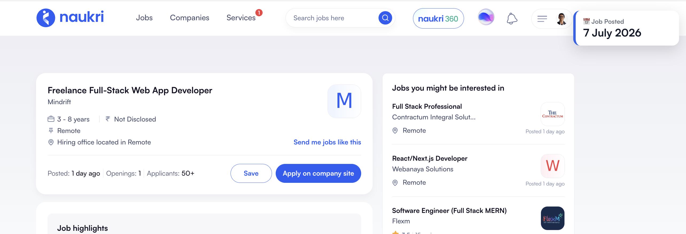
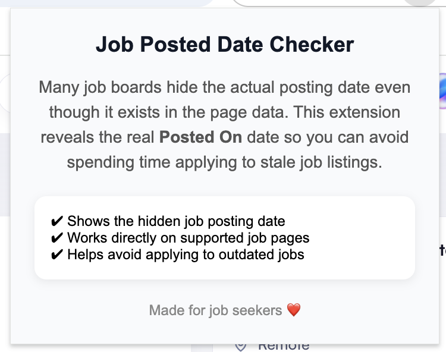

# 📅 Job Posted Date Checker

Many job boards hide the actual **posting date** of a job, even though the information is available in the page's structured data (JSON-LD).

This Chrome extension reveals the hidden **Date Posted** directly on the job page, helping you avoid spending time applying to stale or outdated job listings.

<p align="center">
  
</p>
---

## ✨ Features

- 📅 Displays the real job posting date
- ⚡ Works automatically on supported job pages
- 🎯 Helps avoid applying to old job listings
- 🪶 Lightweight and privacy-friendly
- 🔒 No tracking. No data collection.

---

## Why?

<p align="center">
  
</p>

Many job boards display vague labels like:

- "30+ days ago"
- "Recently posted"
- Or sometimes don't show any posting date at all.

However, the actual posting date is often available inside the page's structured metadata (`application/ld+json`).

This extension simply extracts that hidden information and displays it in a clean, non-intrusive card.

---

## Supported Websites

The extension works on websites that expose a `JobPosting` schema containing a `datePosted` field.

Examples include:

- Indeed
- SimplyHired
- Talentwell
- and many more...

If a website doesn't expose the posting date in its structured data, nothing is shown.

---

## Installation

### From Source

1. Clone this repository

```bash
git clone https://github.com/Sangeetaaaa/jobdatechecker.git
```

2. Open Chrome

3. Go to

```
chrome://extensions
```

4. Enable **Developer Mode**

5. Click **Load unpacked**

6. Select the project folder

Done 🎉

---

## How it works

The extension:

1. Detects `application/ld+json` scripts.
2. Finds the `JobPosting` schema.
3. Reads the hidden `datePosted` property.
4. Displays the posting date as a floating card on the page.

No external APIs are used.

---

## Privacy

This extension:

- ❌ Does not collect data
- ❌ Does not send data anywhere
- ❌ Does not track users
- ✅ Everything happens locally in your browser

---

## Roadmap

- Support more job boards
- Detect expired listings
- Show "Days Since Posted"
- Dark mode
- Customizable card position

---

## Contributing

Contributions, ideas and bug reports are always welcome!

Feel free to open an issue or submit a pull request.

---

## License

MIT License

---
